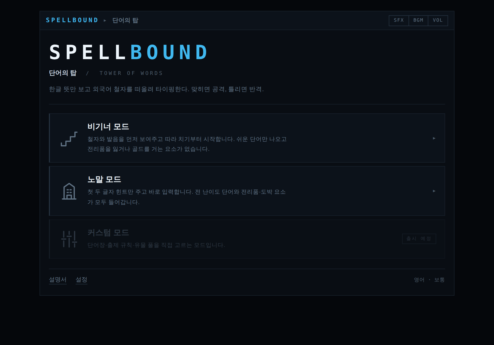
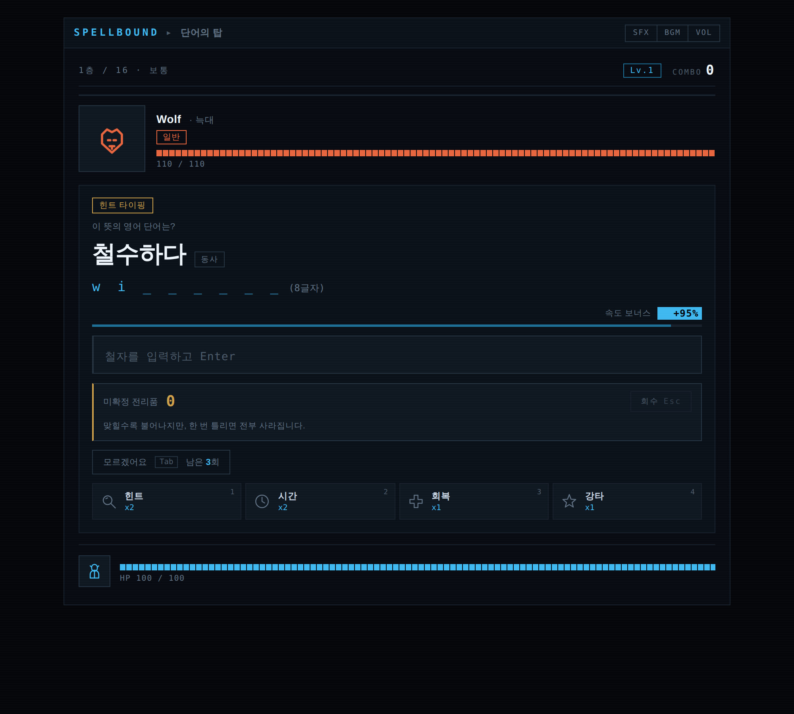
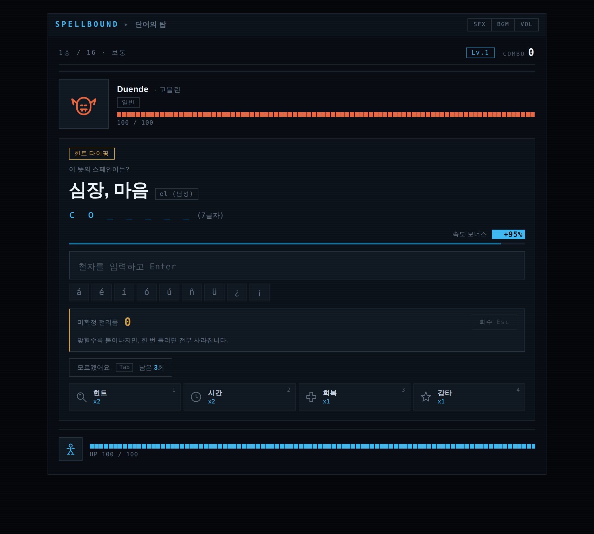
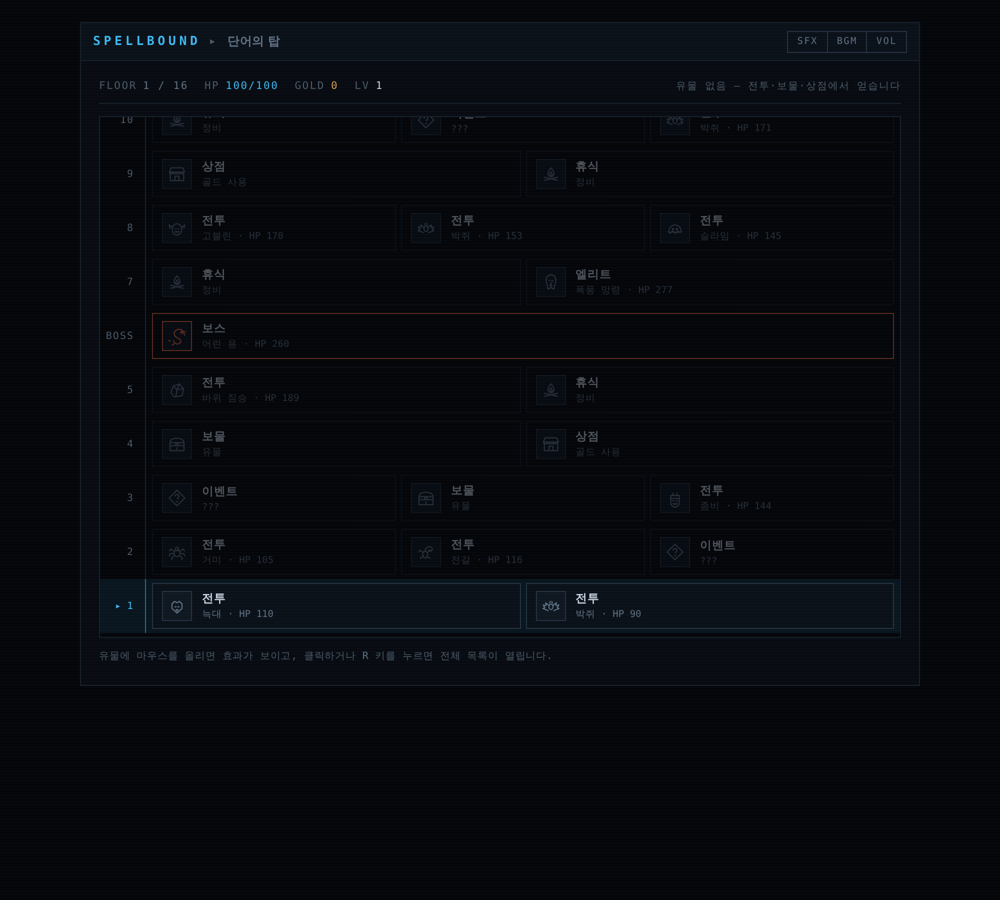

# SPELLBOUND — 단어의 탑

**한글 뜻만 보고 외국어 철자를 기억에서 꺼내 타이핑하는 어휘 학습 로그라이크.**
맞히면 공격, 틀리면 반격. 설치도 계정도 없이 브라우저에서 바로 실행됩니다.

<p align="center">
  
</p>

> 🎮 **플레이하기 :** <!-- 배포 후 여기에 GitHub Pages 주소를 넣으세요 -->
> `https://<사용자명>.github.io/<저장소명>/`

---

## 왜 만들었나

타자 연습 게임과 어휘 학습은 잘 어울려 보이지만, 실제로는 **서로를 무력화합니다.**

타자 게임은 칠 단어를 화면에 띄워야 합니다. 그런데 그 순간 학습자는 철자를 기억에서
꺼낼 이유가 사라집니다. 눈에 보이는 글자를 손으로 옮기는 건 시각·운동 과제일 뿐,
어휘 기억을 만들지 않습니다. 빠르게 치는 연습이지 외우는 연습이 아닙니다.

인지심리학의 **인출 연습(retrieval practice)** 연구는 정반대를 말합니다. 기억은
집어넣을 때가 아니라 **꺼낼 때** 강해지고, 꺼내기 어려울수록 더 오래 남습니다.

SPELLBOUND는 이 한 가지를 게임 규칙으로 만들었습니다. **철자를 절대 먼저 보여주지
않습니다.** 화면에 뜨는 것은 한글 뜻뿐이고, 플레이어는 기억에서 철자를 꺼내 입력해야
합니다. 틀리면 HP가 깎입니다 — 진지하게 떠올릴 이유를 만들기 위해서입니다.

<p align="center">
  
  
</p>

---

## 핵심 설계 세 가지

### 1. 철자를 보여주지 않는다

일반적인 타자 게임은 `cloud` 를 띄우고 따라 치게 합니다. 여기서는 **`구름`** 만 띄우고
`cl___` 정도의 최소 힌트만 줍니다. 학습자는 반드시 기억을 인출해야 합니다.

단 **처음 보는 단어는 예외**입니다. 한 번도 만난 적 없는 단어까지 인출을 요구하면
그건 학습이 아니라 좌절이므로, 첫 노출에는 철자와 발음을 보여주고 따라 치게 하되
**틀려도 손해를 주지 않습니다.** 2회차부터 인출을 요구합니다.

### 2. 실패에 대가가 있다

오답은 HP 손실로 이어집니다. 대가가 없으면 사람은 대충 찍고 넘어가며, 그 순간
인출은 일어나지 않습니다. "모르겠어요"(Tab) 버튼을 따로 두되 횟수를 제한해서,
포기와 시도 사이에서 실제로 고민하게 만듭니다.

### 3. 로그라이크가 복습 구조를 만든다

<p align="center">
  
</p>

어휘 학습의 최대 적은 난이도가 아니라 **중도 포기**입니다. 반복이 전제인 학습에서
다시 오지 않으면 도구로서 실패한 것입니다.

16층 분기 맵, 매판 달라지는 경로, 유물 조합, 층 도전 — 로그라이크는 반복 플레이
동기를 만드는 검증된 문법이고, 어휘 학습이 요구하는 반복 주기와 구조가 맞아떨어집니다.
틀린 단어는 큐에 다시 들어가 그 판 안에서 재출제됩니다.

---

## 지금 담긴 것

| 항목 | 내용 |
|---|---|
| 언어 | 영어, 스페인어 |
| 단어 수 | 언어당 **500개** (5단계 난이도 × 100개) |
| 스페인어 문법 | 명사의 성(el/la), 동사 불규칙 변화(e→ie, o→ue, e→i, u→ue) 표기 |
| 모드 | 비기너(따라 치기 중심) · 노말(인출 중심) · 커스텀(예정) |
| 던전 | 16층 분기 맵 — 전투 · 엘리트 · 보스 · 상점 · 보물 · 휴식 · 이벤트 |
| 유물 | 26종, 조합에 따라 타자 규칙 자체가 바뀜 |
| 발음 | Web Speech API 기반 재생, 미지원 환경 폴백 포함 |
| 저장 | 브라우저 localStorage — 서버로 아무것도 보내지 않음 |
| 배포 형태 | 단일 HTML 파일 (약 187 KB) |

---

## 기술 구조

의존성 없는 **Vanilla JavaScript**입니다. 프레임워크도 게임 엔진도 쓰지 않았습니다.

이 게임의 병목은 렌더링이 아니라 인출 판정과 학습 데이터 수집입니다. 게임 엔진의
값어치(렌더 루프, 씬 그래프, 물리, 충돌 판정)는 여기서 하나도 쓰이지 않는 반면,
엔진을 쓰면 배포 용량이 수십 MB로 불어나 "링크만 주면 바로 실행"이라는 장점을
잃게 됩니다.

```
src/
├── engine.html      게임 셸 — 화면 구조 · 스타일 · 로직
├── data_en.js       영어 단어 500개
├── data_es.js       스페인어 단어 500개
├── art.js           SVG 아이콘 57종
└── rogue.js         맵 생성 · 유물 · 이벤트

build.py             src/ → dist/index.html 한 장으로 병합
tests/               Playwright 회귀 테스트 4종
```

**빌드는 문자열 병합 한 번**이 전부입니다. 결과물이 파일 하나라서 정적 호스팅에
올리는 것만으로 배포가 끝나고, 오프라인에서도 더블클릭하면 실행됩니다.

---

## 실행 방법

### 그냥 해보기

`dist/index.html` 을 더블클릭하면 됩니다. 서버도 설치도 필요 없습니다.

### 직접 빌드하기

```bash
python3 build.py          # dist/index.html 생성
python3 build.py --check  # 단어 데이터 무결성만 검사 (중복·결측·티어 수)
```

### 테스트

```bash
pip install playwright
playwright install chromium

python3 tests/test_core.py    # 핵심 흐름 · UI · 저장
python3 tests/test_rogue.py   # 맵 생성 · 유물 · 이벤트 · 보스
python3 tests/test_learn.py   # 학습 설계 (인출 · 힌트 · 숙련도)
python3 tests/test_psych.py   # 보상 · 도박 · 심리 요소
```

네 스위트 모두 **실제 브라우저에서 게임을 플레이하며** 게임 내부 상태를 직접
검증합니다. main 브랜치로 가는 모든 PR에서 GitHub Actions가 자동 실행하고,
하나라도 실패하면 병합이 막힙니다.

---

## 진행 중인 작업

이 저장소는 캡스톤 프로젝트로 계속 개발되고 있습니다. 현재는 동작하는 프로토타입
단계이고, 학기 목표는 다음과 같습니다.

- **간격 반복 출제** — 틀린 단어는 곧, 맞힌 단어는 간격을 넓혀 재출제
- **AI 맥락 판정 전투** — 유의어·다의어처럼 정답이 하나로 고정되지 않는 문제를
  LLM이 맥락으로 판정하는 특수 전투
- **커스텀 모드** — 단어장과 출제 규칙을 직접 구성
- **학습 효과 검증** — 인출 방식이 따라 치기 방식보다 지연 회상률을 높이는지
  통제 실험(무작위 배정, 7일 지연 사후 테스트)으로 확인

마지막 항목이 이 프로젝트의 핵심입니다. 학습 효과를 주장이 아니라 **데이터로**
제시하는 것이 목표이고, 가설이 기각되더라도 그 원인 분석을 결론으로 삼습니다.

---

## 팀

| 이름 | 담당 |
|---|---|
| 이희건 | 팀리더 · PM — 일정 · 리스크 · 산출물 관리 |
| 우정민 | 기획 · 발표 — 학습 설계, 실험 설계 및 진행 |
| 강수정 | UI/UX · 오디오 — 화면 구현, 사운드, 시연 |
| 정민석 | 개발 — 게임 엔진, 저장, 로그, 빌드, 배포 |
| 박종효 | AI · 데이터 — 단어 데이터, 출제 알고리즘, 통계 분석 |

역할은 주 업무이며 개발에는 전원이 참여합니다.
협업 규칙은 [CONTRIBUTING.md](CONTRIBUTING.md) 를 참고하세요.

---

## 라이선스

MIT
